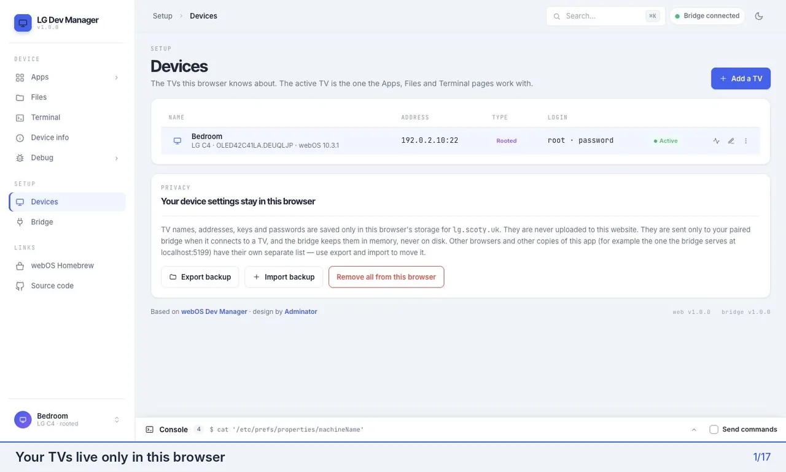
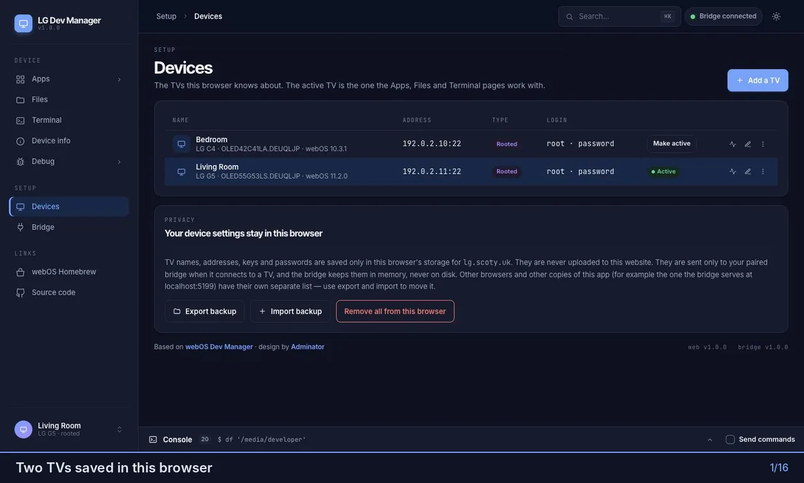

# 📺 LG Dev Manager

Manage LG webOS TVs from your browser — rooted (Homebrew Channel) or in Developer Mode. Install apps from the
webOS Homebrew repository or from an IPK file, update them, install any build of [Litefin](#litefin-in-one-click)
in one click, browse the TV's files, open a shell, take screenshots, renew the Dev Mode session and dig into logs and
the luna bus.

🌐 **Open it:** https://lg.scoty.uk — then run the bridge on your computer (one command, below).

A web rebuild of [webosbrew/dev-manager-desktop](https://github.com/webosbrew/dev-manager-desktop), styled after
[Adminator](https://github.com/puikinsh/adminator-admin-dashboard).

> ⚠️ **Note:** LG Dev Manager is an independent, community project. It is not affiliated with, endorsed by or supported
> by LG Electronics. LG and webOS are trademarks of LG Electronics. Rooting a TV or using Developer Mode is at your own
> risk.

### 🎬 Add a TV, install an app and update it



### 🐞 Debug tools on a rooted TV



## 🚀 Get started

The app needs a small helper on your computer, **the bridge** (why: [How it works](#how-it-works)). There are three
ways to run it. It's the same bridge every time, so pick whichever suits you:

| | Needs | How |
|---|---|---|
| 🖥️ **The app** | nothing | Download it from the [latest release](https://github.com/Scoty/lg-dev-manager/releases/latest) and open it |
| 📦 **npx** | Node.js 22.12+ | `npx lg-dev-manager-bridge@latest` in a terminal |
| 🛠️ **From the source code** | Node.js 22.12+ | [Clone, build and run](#run-from-source) |

### 🖥️ Option 1: the app — no Node.js needed

One file with everything inside. Download the one for your computer from the
[latest release](https://github.com/Scoty/lg-dev-manager/releases/latest):

| Computer | File |
|---|---|
| 🪟 Windows | `lg-dev-manager-bridge-<version>-windows-x64.exe` — just run it (also works on Windows on ARM) |
| 🍎 Mac with Apple Silicon (M1 and newer) | `…-macos-arm64.dmg` — open it, then double-click `lg-dev-manager-bridge` |
| 🍎 Mac with Intel | `…-macos-x64.dmg` |
| 🐧 Linux (x64 / ARM64) | `…-linux-x64.tar.gz` / `…-linux-arm64.tar.gz` — `tar -xzf …`, then `./lg-dev-manager-bridge` |

A window opens with the **pairing token**, and https://lg.scoty.uk opens in your browser. Keep the window open while you
use the app; closing it stops the bridge.

> 🔐 **The first time:** the app isn't signed by Apple or Microsoft (that costs a yearly fee), so your computer asks
> before running it. **Windows**: "Windows protected your PC" → **More info** → **Run anyway**. **macOS**: "Apple
> could not verify…" → **Done**, then **System Settings → Privacy & Security** → **Open Anyway**. You only do this
> once. It's the same code as the npm package, built and tested by GitHub Actions in public. Each release lists
> SHA-256 checksums.

### 📦 Option 2: npx

**You need [Node.js](https://nodejs.org) 22.12 or newer** (any current LTS — 22 or 24). `node --version` shows
yours. In a terminal:

```bash
npx lg-dev-manager-bridge@latest
```

It prints a **pairing token**. Keep the terminal open while you use the app (Ctrl+C stops it).

### 🔗 Then, whichever way you chose

1. Open **https://lg.scoty.uk**, or the local page the bridge serves at **http://localhost:5199** — they are the
   same app. On the **Bridge** page, paste the token.
2. On **Devices → Add a TV**, pick your TV from the scan. Rooted TVs log in as root (Homebrew Channel's SSH server);
   other TVs use the Developer Mode app and its passphrase.

🍎 On macOS, the first time the bridge looks for your TV, the system asks whether your terminal may find devices on the
local network — choose **Allow**. 📱 Phones and tablets aren't supported: the bridge has to run on the same computer
as the browser.

Which page to use is up to you. 🌐 **lg.scoty.uk** always has the latest version and needs nothing installed besides the
bridge. 🏠 **http://localhost:5199** is served from your computer by the bridge itself, so it works even when the
website can't be reached. Each keeps its own list of TVs (browsers store them per site); use **Export backup** / **Import backup** on
the Devices page to move them.

<a id="how-it-works"></a>

## 🔧 How it works

Browsers can't open SSH connections, so the app comes in two parts:

```
 Browser (lg.scoty.uk or localhost:5199)        Your computer                      Your TV
 ┌──────────────────────────────────┐   WebSocket   ┌────────────────────┐   SSH / SFTP   ┌──────────────┐
 │ Web app — your TVs, keys and     │ ────────────▶ │ Bridge             │ ─────────────▶ │ webOS        │
 │ passwords are stored only here   │  127.0.0.1    │ (app or npx)       │                │ (port 22 or  │
 └──────────────────────────────────┘  + token      └────────────────────┘                │  9922)       │
                                                                                          └──────────────┘
```

- 🖥️ **The web app** is a static site. Saved TVs — names, addresses, keys and passwords — live only in your browser's
  storage. They are never sent to the website; each request sends them to your own bridge, and only to it.
- 🌉 **The bridge** is a small Node.js program that does the SSH, SFTP and HTTP work the browser can't. It listens on
  `127.0.0.1` only (nothing else on your network can reach it), accepts only the app's own pages, needs the pairing
  token, and keeps nothing on disk except that token. It offers fixed operations — list apps, install, read a log —
  never a general "connect anywhere" tunnel.
- 📦 **Homebrew repository and Litefin releases** are fetched by the bridge, so the site itself talks to no one but your
  bridge. Downloads are checked against their published SHA-256 whenever one is published.

🔄 The bridge tells the site its version; when a newer one is out, the app says so and how to update: download the
new app from the [releases](https://github.com/Scoty/lg-dev-manager/releases/latest), or run
`npx lg-dev-manager-bridge@latest` again. Your pairing and TVs stay as they are.

## ✨ What it does

- 📡 **Devices** — network scan, add rooted or Developer Mode TVs (key fetched from the TV's key server, or a new key
  made for it), edit, test, export / import.
- 📦 **Apps** — installed apps with update badges; install IPK files (drag and drop); the webOS **Homebrew repository**
  with search, details, install and update; the **Litefin repo** with every webOS build of the latest releases
  (see [below](#litefin-in-one-click)).
- 📁 **Files** — browse, upload, download, preview, rename, delete over SFTP.
- 💻 **Terminal** — full shell in tabs, plus a simple mode for TVs without a terminal.
- ℹ️ **Device info** — model, webOS and firmware, Homebrew Channel status and update, screenshots, Dev Mode session
  countdown and renewal.
- 🐞 **Debug** — live system log and kernel log, PmLog levels, crash reports, luna bus monitor (rooted TVs).
- 🧾 **Console** — every command the bridge runs on the TV, live, with the option to type your own.

🌗 Light and dark themes, a command palette (⌘K / Ctrl K), and no analytics or tracking.

<a id="litefin-in-one-click"></a>

## 🍿 Litefin in one click

This app started with one itch. [Litefin](https://github.com/MoazSalem/litefin), a lightweight Jellyfin client for
LG TVs, publishes a separate IPK for each generation of webOS (Modern, Normal, Legacy, Ultra Legacy) on every
release, and the Homebrew repository carries only one of them. Updating used to mean opening the GitHub releases,
downloading the right IPK by hand and installing it through the desktop webOS Dev Manager.

👉 **Apps → Litefin repo** does all of that in one click:

- It lists the last five Litefin releases with every webOS build side by side, read straight from GitHub by the
  bridge (pre-releases are skipped).
- It suggests the right build for the active TV from its webOS version, and shows which version is installed and
  whether a newer one is out.
- **Install** downloads that build, checks it against GitHub's SHA-256 when one is published, and installs it on the TV
  — through Homebrew Channel on a rooted TV, or the Developer Mode installer otherwise. All builds are the same app,
  so switching builds or versions simply replaces it.

<a id="run-from-source"></a>

## 🛠️ Run the bridge from the source code

The third way: run it from a clone. It's the same bridge, and it serves the local page too:

```bash
git clone https://github.com/Scoty/lg-dev-manager.git
cd lg-dev-manager
corepack enable      # once, to get pnpm
pnpm install
pnpm build
pnpm bridge          # same as: node apps/bridge/dist/cli.js
```

This needs Node.js 22.12 or newer, the same as npx (the project itself is developed on Node 24, see `.nvmrc`).
To update: `git pull`, `pnpm install`, `pnpm build`, then `pnpm bridge`.

Bridge options (`--help`; with the app, run it from a terminal: `lg-dev-manager-bridge --help`):

| Option | |
|---|---|
| `--port <n>` | Port to listen on (default 5199) |
| `--no-ui` | Don't serve the local page |
| `--allow-origin <url>` | Also accept another origin, e.g. a self-hosted copy of the web app |
| `--reset-token` | Make a new pairing token (un-pairs every browser) |
| `--no-open` | The app only: don't open lg.scoty.uk in the browser when it starts |
| `--license` | Show the licenses of the bridge and everything it includes |

## 🧪 Development

```bash
pnpm install
pnpm dev            # web app (Vite, http://localhost:5173) + bridge with --dev
pnpm test           # unit and integration tests (against a mock TV)
pnpm e2e            # Playwright: built app + real bridge + mock TVs + fake Homebrew repo
pnpm dev:rig        # the same rig to try by hand: http://127.0.0.1:5299, token e2e-token
pnpm lint && pnpm typecheck
pnpm app            # the standalone app for this computer → apps/bridge/release (after pnpm build)
```

`tools/mock-tv` fakes webOS TVs (SSH, luna-send, key server, logs) so everything can be tested without a TV.
Contributors, human or AI: read [AGENTS.md](AGENTS.md) and [PLAN.md](PLAN.md) first.

## 🙋 Problems and ideas

[Open an issue](https://github.com/Scoty/lg-dev-manager/issues/new/choose): there are forms for bugs, connection
problems and feature requests that ask for what helps track a problem down. Security problems: please report them
privately (see the [security policy](https://github.com/Scoty/lg-dev-manager/security/policy)).

## 📄 License

[Apache-2.0](LICENSE). You may use, change and share the app and its code freely, including commercially, as long
as you keep the license and the [NOTICE](NOTICE) file that credits its authors — this project, the original
[dev-manager-desktop](https://github.com/webosbrew/dev-manager-desktop) by the webOS Homebrew team, and Adminator.

Not affiliated with or endorsed by LG Electronics. LG and webOS are trademarks of LG Electronics.
